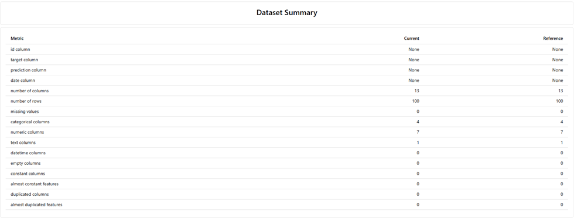
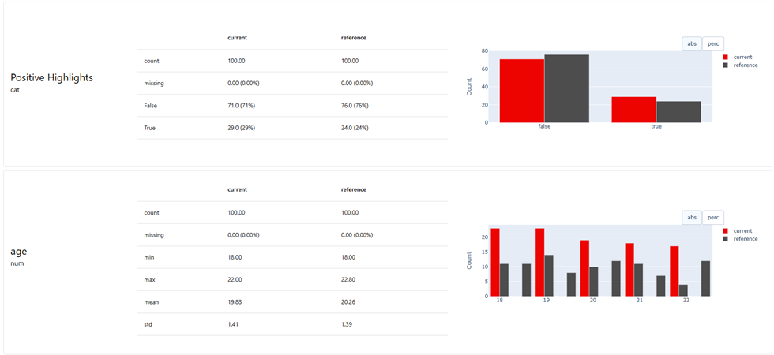
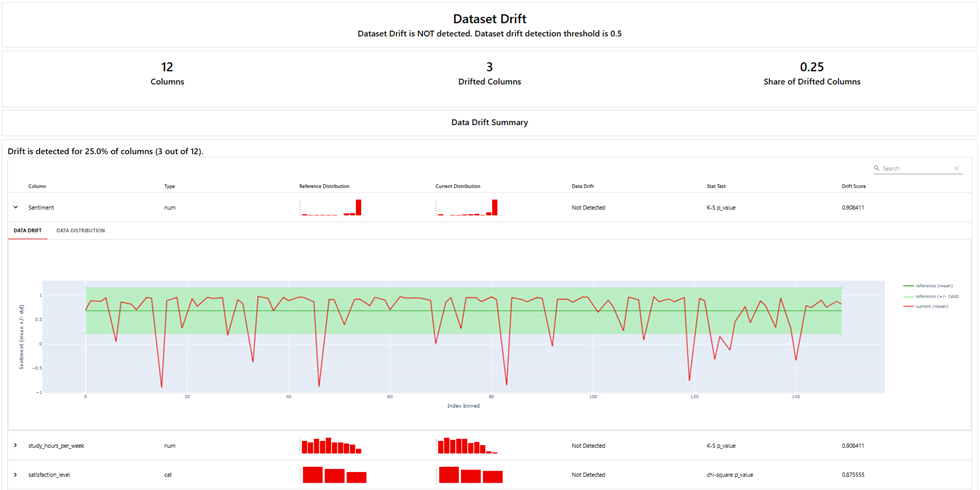
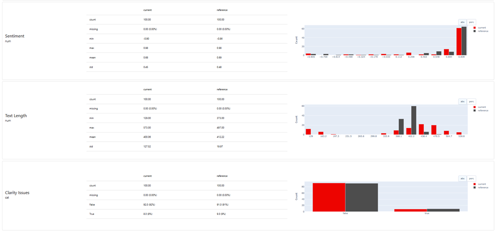
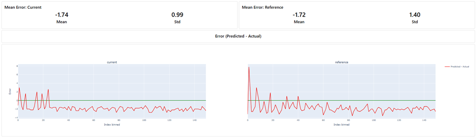
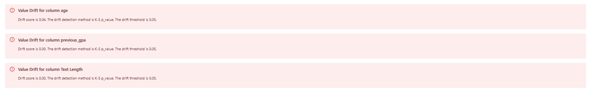

# Student Performance Evaluation with Evidently AI

## Introduction

The goal of this project is to use Evidently AI to evaluate and monitor the performance of an ML model in production.

Since the data is dynamic by itself, we need to continuously monitor changes in both our data and model performance in the production environment. Evidently is an open-source Python library that provides over 100 evaluation metrics, helping to maintain reliable, high-performance AI products.

To familiarize ourselves with Evidently AI, we used ChatGPT to generate synthetic datasets that simulate data from a production ML model.

In this report, we will start by explaining the datasets used in the project, and then demonstrate how Evidently AI is used to create a report containing evaluation metrics and performance monitoring.

## Datasets

To use Evidently AI, we need two datasets:

- **Reference dataset**: Represents the baseline data when the model was originally trained.
- **Current dataset**: Represents the actual or live production data we want to monitor and evaluate.

Since we don’t have a real ML model, we used ChatGPT to create these datasets. Evidently compares them to detect data drift or significant changes in model performance.

The dataset contains a list of students’ information and their grades. The AI model uses these features to predict grades. Evidently AI is used to evaluate the model's performance and the data quality.

## Data Features

The dataset includes the following columns:

- `student_id`: Non-informative feature (numerical identifier for students)
- `age`: Numerical
- `study_hours_per_week`: Numerical
- `previous_gpa`: Numerical
- `course_difficulty`: Categorical (takes values: easy, medium, hard)
- `actual_grade`: Numerical value represents students’ actual grade (takes values: between 0 and 100)
- `predicted_grade`: Numerical value represents students’ predicted grade (takes values: between 0 and 100)
- `satisfaction_level`: Categorical value represents students’ satisfaction with the course. (takes values: high, medium, low).
- `feedback_text`: Textual feedback from students about the course course (we added this feature to examine the ability of evidently to deal with text input and measure sentiments of users’ feedback)

## Evidently Setup

1. **Reading the Datasets**:  
    We read the datasets from CSV files using `pandas` (a library in Python used to deal with dataframes) and specify current and reference datasets:

   ```python
   ref_df = pd.read_csv("../data/students_reference_dataset.csv")
   curr_df = pd.read_csv("../data/students_current_dataset.csv")
   ```

2. **Defining the Schema**:

   We have to provide the input details and the target value (the value that our model has predicted, in our case it is predicted grade).

   To do that we use `Data Definition` to specify the structure and semantics of our datasets by defining each column type (numerical/categorical/text) and which columns are our target and prediction, and the type of model we want to use (regression or classification). This step is critical for Evidently to generate correct metrics, drift detection and performance monitoring.

   ```python
   schema = DataDefinition(
    numerical_columns=[
        "age",
        "study_hours_per_week",
        "previous_gpa",
        "actual_grade",
        "predicted_grade"
    ],
    categorical_columns=[
        "course_difficulty",
        "satisfaction_level"
    ],
    text_columns=[
        "feedback_text"
    ],
    regression=[
        Regression(
            target="actual_grade",
            prediction="predicted_grade"
        )
    ]
   )
   ```

   Since our target values are continuous numerical values, this means our model is a regression model. This information is necessary to provide to Evidently, as it affects the choice of the evaluation methods it uses. (evaluation methods used in classification models are different).

3. **Text-Based Descriptors**:

   Our dataset includes a text column which represents the feedback of the students, we can run some text-based descriptors provided by Evidently to extract useful information from the text. For example, we can apply:

   - **Sentiment**: analyze the text and give a value between -1 (very unsatisfied) and +1 (very satisfied) to it.
   - **TextLength**: measures the length of each text entry which helps to detect user engagement.
   - **Contains**: We use it to filter keywords in the text, for example, the clarity or positive highlights.

   ```python
    descriptors = [
        Sentiment("feedback_text", alias="Sentiment"),
        TextLength("feedback_text", alias="Text Length"),
        Contains("feedback_text", items=["confusing", "unclear", "repetitive"], alias="Clarity Issues"),
        Contains("feedback_text", items=["excellent", "rewarding", "valuable"], alias="Positive Highlights")
    ]
   ```

   While these features aren’t directly related to the model, they provide insights into student opinions, which can help improve the course.

4. **Choosing Presets**:

   We choose the presets that we need from Evidently presets. **_Presets_** are pre-built evaluation templates that are easy to use without setup. They contain collections of metrics, analyses and visualizations bundled together into a single report. They simplify the report generation by calling a single preset instead of specifying individual metrics manually.

   In our project we called the following presets:

   - **`DataSummaryPreset`**:
     It visualizes key descriptive statistics for the dataset and each column in it:

     - Dataset stats: show stats like number of rows/columns, empty columns/rows, missing values …etc.
     - Column stats. Shows relevant statistics and visualizes distribution for each column. The stats are different based on the column type (numerical, categorical, text, datetime).

   - **`DataDriftPreset`**:
     Evaluates shifts in data distribution between the reference and current datasets to detect significant changes. If the **p-value < 0.05** that indicates that the feature has changed statistically (drift detected). It uses statistical tests like

     - Kolmogorov-Smirnov Test (KS-test): it measures the difference between distributions in reference and current datasets for numerical columns like _age_ and _actual_grade_.
     - Chi-Square Test: it measures the difference between distributions in reference and current datasets for categorical columns like _course_difficulty_ and _satisfaction_level_.

   - **`TextEvals`**:
     analyze and visualize the results of text-based descriptors (eg: Sentiment, TextLength, Contains).

   - **`MeanError`**: it measures the average difference between predicted and actual values in the regression model. It is good to show the bias in the regression model prediction.
     > Formula: Mean Error = Sum of all error values/Number of records

   Some other regressive metrics:

   - Mean Absolute Error (MAE): it measures the average of the absolute differences between predictions and actual values. It is good to show the average size of the errors, regardless of direction.
   - Root Mean Squared Error (RMSE): it measures the square root of the average of squared differences between predicted and actual values. It is more sensitive to outliers than **MAE** because by squaring the errors we penalizes larger errors more than smaller ones.

5. **Generate the report and save it as an HTML file**:

   We generate the report after choosing the needed Presets and then save it as an HTML file.

   ```python
   # Generate the report using these Evidently presets
    report = Report([
        DataSummaryPreset(),
        DataDriftPreset(),
        TextEvals(),
        MeanError()
    ], include_tests=True)

    result = report.run(reference_data=ref_data, current_data=curr_data)

    # Save HTML report
    result.save_html("../reports/student_full_evaluation_report.html")
   ```

## Understanding the Output Report

### 1. Dataset Summary:

First section shows an overview of the data we have (e.g. number of columns, rows, missing values, categorical columns, numeric columns …etc.)



Second section: shows relevant statistics and visualizes distribution for each column. The stats are different based on the column type (numerical, categorical, text, datetime).



### 2. Dataset Drift:

Evidently Checks for shifts in each column. The drift detection method is chosen automatically based on the column type and number of observations.
Overall dataset drift returns the share of drifting columns in the Dataset. By default, Dataset Drift is detected if at least 50% of columns drift.

In our project there is no dataset drift detected as the share of drifted columns is 25%.



The threshold of **P-value** in Evidently is set by default to **0.05**. Based on this threshold, Evidently considers the features as drifted if **P-value < 0.05**.

- The following features from our dataset are considered as **not drifted** (P-value >= 0.05):

  `study_hours_per_week`, `actual_grade`, `predicted_grade`, `satisfaction_level`, `course_difficulty`

- The following features from our dataset are considered as **drifted** (P-value < 0.05):
  `age`, `previous_gpa`, `TextLength`

> The p-value is a statistical measure that helps determine whether there is a significant difference between two data distributions (e.g. reference vs current). In the context of drift detection:
>
> - A p-value < 0.05 usually means there is a significant change (drift detected).
> - A p-value >= 0.05 suggests the feature has not changed significantly, so no drift is detected.

### 3. Text Descriptor Observations:

It shows the text-based evaluations we did like sentiment and Clarity Issues.



- Positive highlights like "excellent" and "rewarding" appear more often in the current dataset 29% compared to the reference dataset 24% which suggest a possible improvement in user sentiment or satisfaction.
- Some feedback flagged as unclear because they have one or more of these words ["confusing", "unclear", "repetitive"] but were within accepted limits as the change is not significant (8% in current dataset, 9% in reference dataset).

### 4. Mean Error:

From the report, we can see:

- The **Mean Error** in both the current and reference datasets is negative. This indicates that the model is consistently underestimating the actual values (The model tends to predict values slightly lower than the actual ones, in both datasets).
- The difference between the two is very small (-1.74 for the current dataset and -1.72 for the reference), which suggests that the model's behavior is stable over time and there is no significant shift in prediction bias.
- The **Standard Deviation (Std)** is smaller for the current dataset (0.99) compared to the reference dataset (1.40) which means the current model predictions are more stable (the differences between predicted and actual values don't vary widly).



### 5. Test Section

Auto-generated pass/fail tests are included to:

- Check data quality (e.g., missing values, zero variance).
- Identify significant drifts.

Example of failed tests:



## Conclusion

In this project we got an overview about Evidently AI and how it can effectively monitor model performance and detect data drift using structured evaluation reports. It introduced key concepts such as schema definition, regression evaluation, data drift detection, and the use of statistical tests like the Kolmogorov-Smirnov and chi-square. We also explored the text-based descriptors like sentiment and keyword detection which highlighted Evidently’s ability to handle unstructured data like feedback in monitoring workflows.
